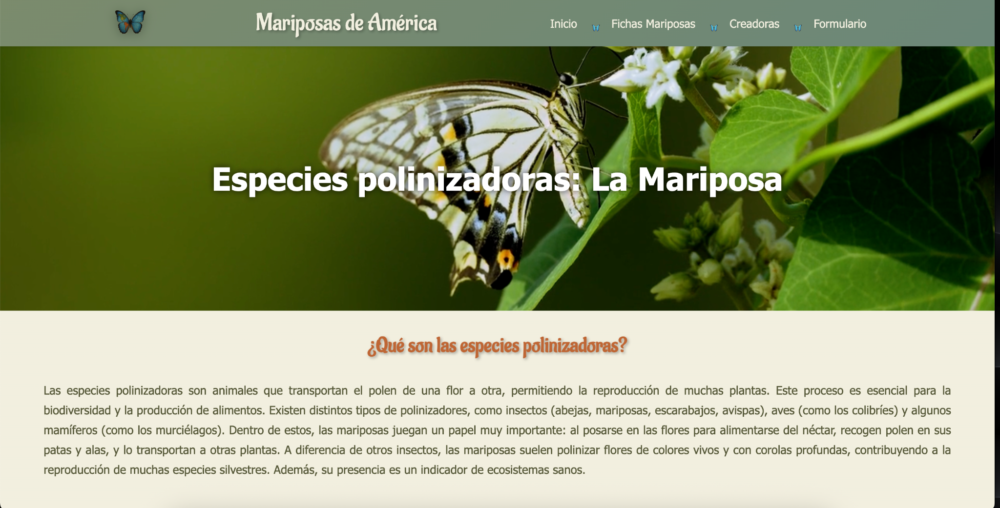
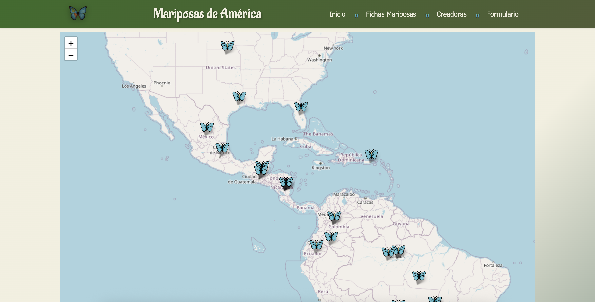
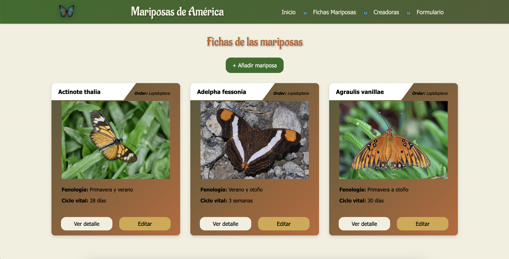
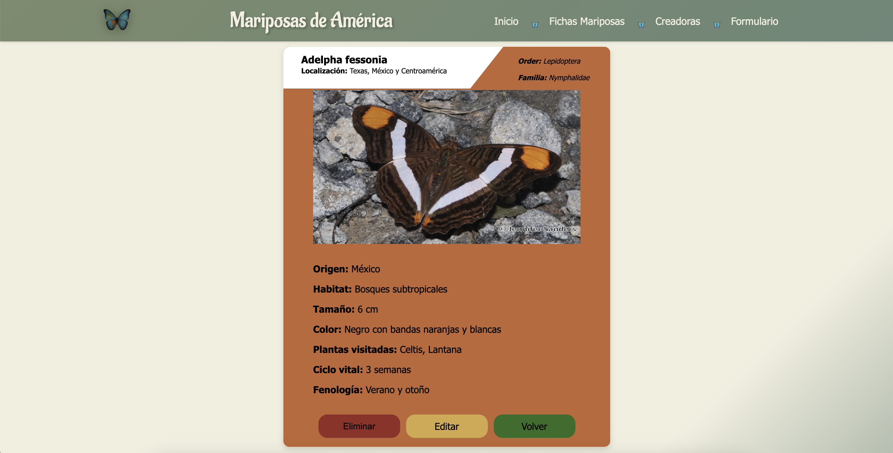
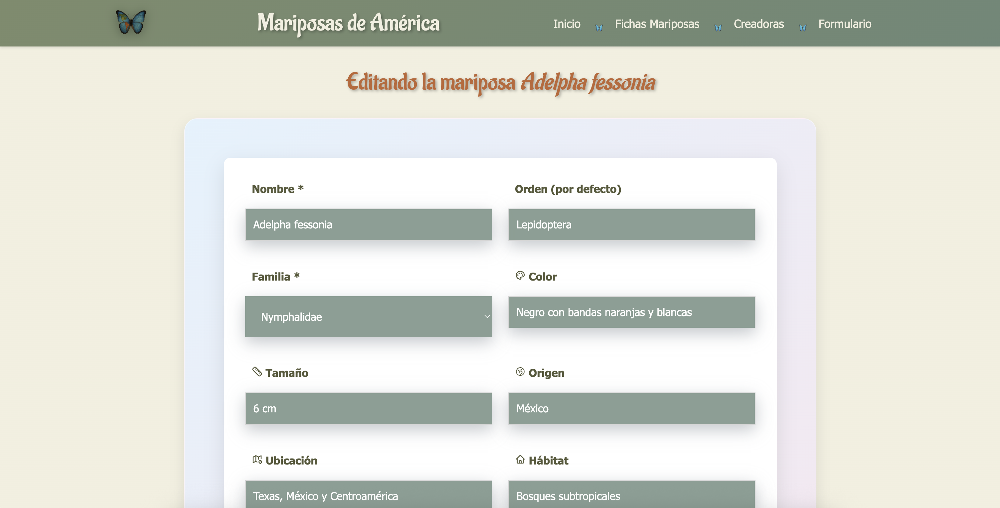
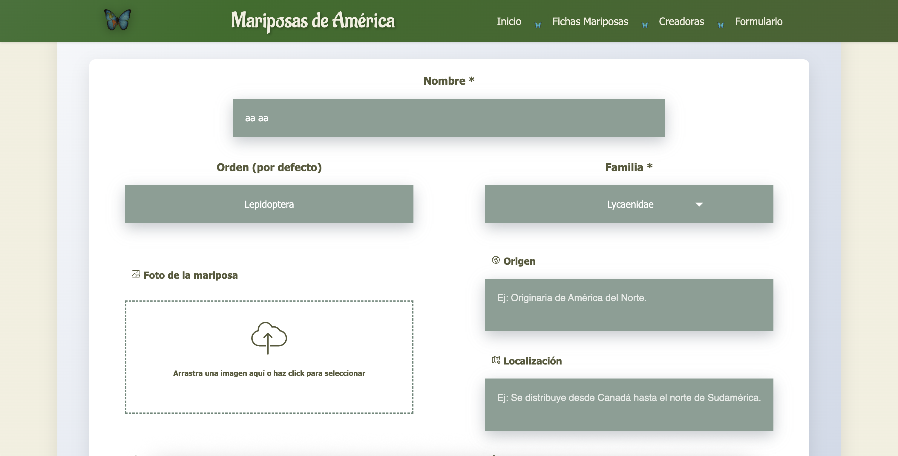
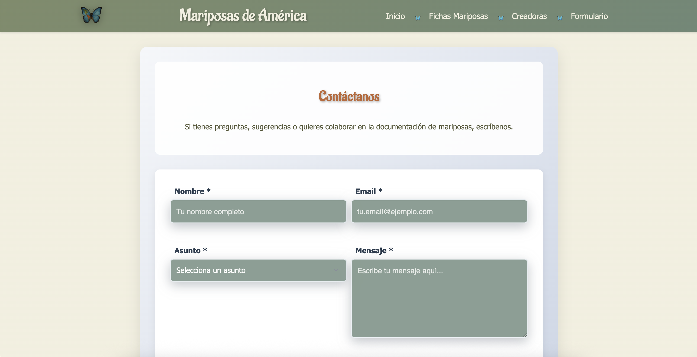

# 🦋 Polinizadores de América: Mariposas

Este proyecto forma parte de una iniciativa educativa basada en el **cuaderno de campo digital**: una aplicación web desarrollada para **documentar y conservar insectos polinizadores** en peligro de desaparición. Nuestro grupo ha trabajado específicamente en el continente 🌎 **América**, centrándonos en las **mariposas**, destacadas polinizadoras y excelentes bioindicadores del estado de los ecosistemas.


## 🌱 Contexto

Los polinizadores están disminuyendo en todo el mundo debido a múltiples factores como el cambio climático, los pesticidas y la pérdida de hábitats. A través de esta herramienta, contribuimos al proceso de **digitalización del conocimiento natural**, tal como promueve la Unión Europea en su **Estrategia de Biodiversidad 2030**.

> Este cuaderno de campo interactivo permite **visualizar, crear, editar y eliminar** registros de mariposas americanas.

## 💻 Objetivo de la app

- Crear una interfaz CRUD que gestione el registro digital de mariposas polinizadoras.
- Fomentar la educación ambiental y el acceso libre a la información biológica.
- Contribuir a la preservación del conocimiento sobre especies nativas del continente americano.

## 📌 Navegación principal y rutas

- `/` → Página de inicio con mapa interactivo.





- `/fichas-mariposas` → Listado de todas las mariposas que tenemos en el catálogo.




- `/detalle-mariposa/:id` → Ficha detallada de una mariposa.




- `/editar-mariposa/:id` → Editar mariposa seleccionada.




- `/nueva-mariposa` → Añadir nueva mariposa.




- `/creadoras` → Equipo que ha realizado el proyecto.


- `/formulario` → Formulario de contacto.




## 🚀 Funcionalidades

- 📋 **Visualización**: Muestra un listado completo de mariposas con información detallada.
- ➕ **Creación**: Permite añadir nuevas especies al cuaderno de campo.
- ✏️ **Edición**: Actualiza los registros existentes.
- 🗑️ **Eliminación**: Elimina registros de forma permanente.
- 🧪 **Testing**: Para verificar el correcto funcionamiento de la web.

## 🎨 Diseño

El diseño de la aplicación fue desarrollado de forma colaborativa a través de un prototipo en Figma. 

### Objetivos del diseño:
- Representar visualmente el concepto de cuaderno de campo digital donde se muestra un catálogo de mariposas polinizadoras de América.
- Emplear una paleta cromática inspirada en la naturaleza (tonos verdes, tierras, rosados y azules similares a las mariposas).
- Ofrecer al usuario una experiencia intuitiva y agradable.
- Garantizar la accesibilidad.
- Diseño responsive.

## 🗂️ Estructura del proyecto

```
polinizadores-mariposas-america/
├── index.html                        ← Archivo HTML principal
├── package.json                      ← Define las dependencias, scripts y metadatos del proyecto.
├── package-lock.json                 ← Registra las versiones exactas de las dependencias instaladas.
├── vite.config.js                    ← Configuración del blunder Vite 
├── eslint.config.js                  ← Define reglas de estilo y calidad de código 
├── README.md                         ← Documentación del proyecto
├── .env                              ← Credenciales de Cloudinary
├── .gitignore                        ← Archivos que no se deben subir a GitHub
├── /server                           ← Lógica del backend (servidor, API, etc.) 
│   └── db.json                       ← Simula una API, contiene las mariposas
└── /src                              ← Código fuente principal del frontend
     ├── /assets                      ← Imágenes y recursos estáticos
     │   └── /images
     │   └── /favicon                                                                                                       
     ├── /components                  ← Componentes reutilizables de React
     ├── /layout                      ← Componentes de estructura (Nav, Footer, etc.)
     ├── /pages                       ← Páginas principales del sitio 
     │   ├── About.jsx                ← Información sobre las creadoras y contacto 
     │   ├── ButterflyCards.jsx       ← Listado de las mariposas registradas
     │   ├── ButterflyDetail.jsx      ← Detalle de una mariposa
     │   ├── CreateButterfly.jsx      ← Formulario para añadir una nueva mariposa
     │   ├── EditButterfly.jsx        ← Formulario para editar una mariposa existente
     │   └── Home.jsx                 ← Inicio
     ├── /router                      ← Configuración de rutas con React Router
     │   └── Router.jsx                                                          
     └── /services                    ← Funciones que llaman a la API: GET, POST, PUT, DELETE
         └── ButterflyServices.jsx                                               
```

## ⚙️ Tecnologías y librerías utilizadas

- ### Tecnologías base 
    - **HTML5, CSS3 y JavaScript**: Fundamentos del desarrollo web.
    - **React**: Librería para construir interfaces de usuario basadas en componentes.
    - **Vite**: Herramienta de construcción para un trabajo rápido y moderno con React.
    - **JSON Server**: Simulación de una API REST a partir de un archivo db.json.

- ### Librerías instaladas 
   - **react-icons**:
     - Biblioteca de iconos que agrupa múltiples sets populares como Font Awesome, Material Icons, etc. 
     - Permite usar iconos como componentes de React.
     - Uso en el proyecto: en los formularios de añadir / editar mariposa y en botones como por ejemplo 'cancelar' para mejorar la interfaz de usuario.
      ```
      import { FaArrowLeft } from "react-icons/fa";
      <button><FaArrowLeft /> Cancelar</button>
      ```
   - **sweetalert2**: 
     - Librería para mostrar mensajes emergentes (modales) personalizables.
     - Mejora la interacción con el usuario mediante alertas visuales claras y con un diseño atractivo.
     - Uso en el proyecto: Confirmar acciones como añadir mariposa, editar o eliminar.
      ```
      import Swal from 'sweetalert2';
      Swal.fire('Mariposa creada con éxito');
      ```
   - **cloudinary**: 
     - Plataforma para subir, almacenar y mostrar imágenes de forma optimizada.
     - Uso en el proyecto: Los usuarios pueden subir imágenes directamente desde el formulario de añadir / editar mariposa. Se almacena la URL para mostrarla en las fichas de las mariposas.
   - **react-leaflet**: 
     - Adaptación de Leafleat para React, permite renderizar mapas interactivos.
     - Uso en el proyecto: Mostrar la ubicación geográfica de especies de mariposas del continente americano en la página de inicio.
   - **@emailjs/browser**: 
     - Kit de desarrollo de EmailJS para enviar correos electrónicos directamente desde el navegador.
     - Uso en el proyecto: Enviar el contenido del formulario de contacto a un correo configurado, sin necesidar de un servidor.
        
## 📦 Instalación y uso

1. Clonar el repositorio:
   ```bash
   git clone https://github.com/irinatiron/polinizadores-america-mariposas.git
   cd polinizadores-america-mariposas

2. Instalar dependencias:
   ```bash
   npm install
   
3. Iniciar el servidor JSON:
   ```bash
   npm run api-fake

4. Ejecutar la aplicación React:
   ```bash
   npm run dev

## 👩🏻‍💻 Creadoras 

Este proyecto ha sido creado por el siguiente equipo:

- Scrum Master + Developer: [Irina Tiron](https://github.com/irinatiron)
- Product Owner + Developer: [María del Carmen Tajuelo](https://github.com/CarmenTajuelo)
- Developer: [Guissella Pérez](https://github.com/guiss26)
- Developer: [Ingrid Martínez](https://github.com/ingridD2707)
- Developer: [Paloma Gómez](https://github.com/Pal-cloud)
